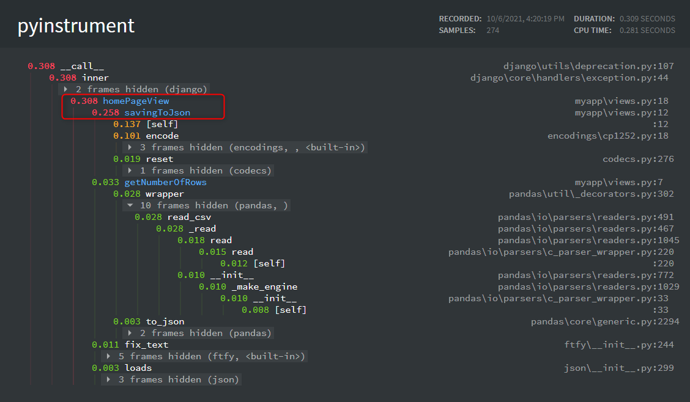

# How to run this Django Application

1. Create and activate a virtual environment:
```shell
    python -m venv <name>

    <name>\Scripts\activate 

    source <name>/bin/activate
```
2. Run Django app with `python manage.py runserver`

# PyInstrument Configuration

1. Install pyinstrument with `pip install pyinstrument`
2. Open `settings.py` for your project and add the middleware clases 
```python

    MIDDLEWARE = [
        'django.middleware.security.SecurityMiddleware',
         #....Other middlewares
        "pyinstrument.middleware.ProfilerMiddleware",
    ]
```
3. If you want to save the html file output in a particular directory you can add this variable in `settings.py`:
```python
    # Define an output directory for PyInstrument
    PYINSTRUMENT_PROFILE_DIR = 'profiles'
```
4. If you want to show the output in the same page, you will need to add a callback function, review this [documentation](https://pyinstrument.readthedocs.io/en/latest/guide.html#profile-a-web-request-in-django). Here is another [example](https://github.com/joerick/pyinstrument/tree/main/examples/django_example).

 
