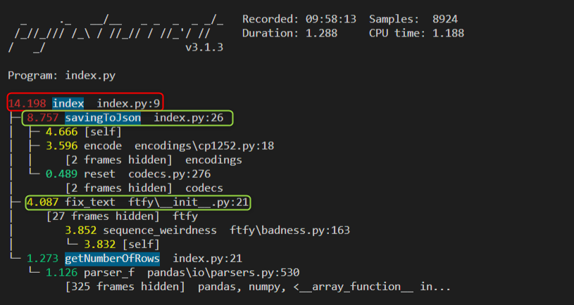
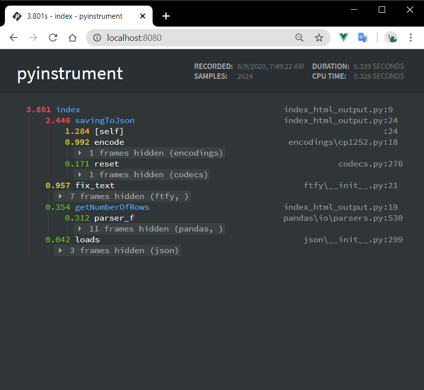

# How to profile cpu with Pyinstrument

1. Download this example using **`git clone https://github.com/azureossd/python-performance-samples.git`**
2. **cd** into **python-performance-samples/cpu/pyinstrument_initial/**

---

## Create a virtual environment and install dependencies
1. Create a virtual environment with any python version >=3.
    - If you are using Windows:
        ```shell
            python -m venv env
        ```
    - If you are using Linux:
        ```shell
            python3 -m venv env
       ```
2. Activate the virtual environment.
    - If you are using Windows in cmd:
        ```shell
            env\Scripts\activate
        ```
    - If you are using Linux
        ```shell
            source env/bin/activate
        ```
3. Once the virtual environment is activated, install **requirements.txt**.
    ```shell
        pip install -r requirements.txt
    ```

## Configuring pyinstrument
1. To install pyinstrument run the following command: **`pip install pyinstrument`**

>  Note: If you have problems installing pyinstrument because of Visual C++ 14 compiler missing on Windows, review the following link to install [build tools](https://wiki.python.org/moin/WindowsCompilers). If you have already installed Visual Studio you can modify the installation to add Desktop development with C++ and you will need to restart your computer.

2. Open index.py and configure the profiler with the following code lines:

```python
    from pyinstrument import Profiler #Import Library
    profiler = Profiler() #Instantiate class object

    @route('/')
    def index():
        profiler.start() #Start profile
        # ... defined chunk of code to profile ...
        results = getNumberOfRows(3000)
        formated_data = json.loads(fix_text(results))
        savingToJson("formated_users.json", formated_data)
        # ... defined chunk of code to profile ...
        profiler.stop() #Stop profile
        print(profiler.output_text(unicode=True, color=True)) #Sending output to console
        return formated_data
```
3. Run the application with `python index.py` and browse to `http://127.0.0.1:8080/` and request the site a similar output will be displayed:

   

4.  Review which method is taking more CPU time

## Pyinstrument implementations
You can generate also html output as followed:
```python
    @route('/')
    def index():
        profiler.start()
        results = getNumberOfRows(3000)
        formated_data = json.loads(fix_text(results))
        savingToJson("formated_users.json", formated_data)
        profiler.stop()
        output_html = profiler.output_html()
        return output_html

```

   

You can find more samples codes in how to implement html output with [Flask](https://github.com/joerick/pyinstrument/blob/master/examples/flask_hello.py) and [Django](https://github.com/joerick/pyinstrument/tree/master/examples/django_example) where you can implement query string arguments to just target a specific request.


## Profile a script with Pyinstrument 
- To install this library you can use the following:

```shell
    pip install pyinstrument 
```

- To run the profile you can type:

```shell
    pyinstrument script.py
```
